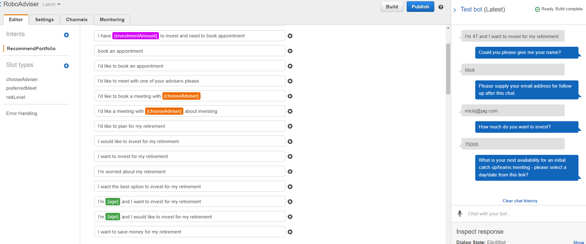

## Project Capstone (Group 3)

### Team Members
* Peter Collins
* Terry Blaser
* Jim Penner
* Wai Fatt Yee

## API, Modules and Libraries Used
* Pandas
* Matplotlib
* Beautiful Soup
* Stremlit
* urllib
* Yahoo Finance API
* Alpha Vantage API

## Purpose
The idea of this project is to develop a tool that helps the decision making process in entering and exiting a stock or ETF/index through technical, sentiment and fundamental analysis indicators.  The main focus is on the Dow Jones Industrial index using a momentum indicator to signal entry or exit levels in the market and a screener that indentifies stocks listed in the index that may outperform the market based on a fundamental matrix.  We aim to identify stocks in the underlying index that are potentially forming a turning point where they are more likely to move in a bullish direction.  We have overlayed the list of stocks with additional indicators to support decision making such as,

*   PE ratio
*   Momentum indicator
*   Sentiment score of recent news

Appended to the screener is a robo chat user interface that collects pertinent information from the user with a view to help him/her to make the right decision on asset allocation and investment selections. The user can also opt to run a Monte Carlo Simulation to back-test as well as project the future value of their portfolio.

## Caveat
This is certainly not meant to be a comprehensive investment model but simply act as a basic entry level tool for other users who may be interested to customise this application to suit their own individual needs.

## Future Enhancements

Essentially, we are looking to develop a tool not only to help users to make investment decisions but also to ensure that they also take into consideration their personal circumstances such as tax implication and retirement planning. It is our hope that this tool can one day be developed into a comprehensive structural advice platform that could end up disrupting and shaking up the financial advisory industry.

